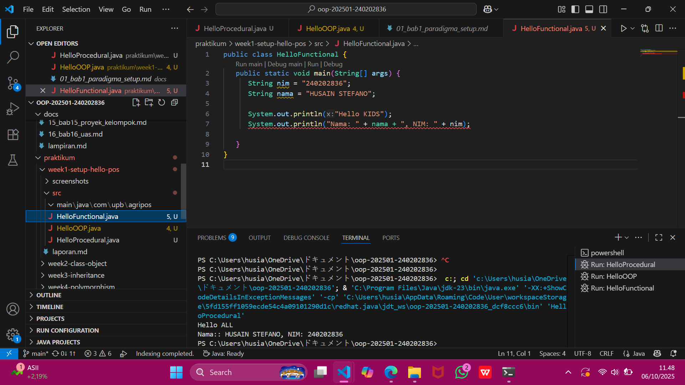
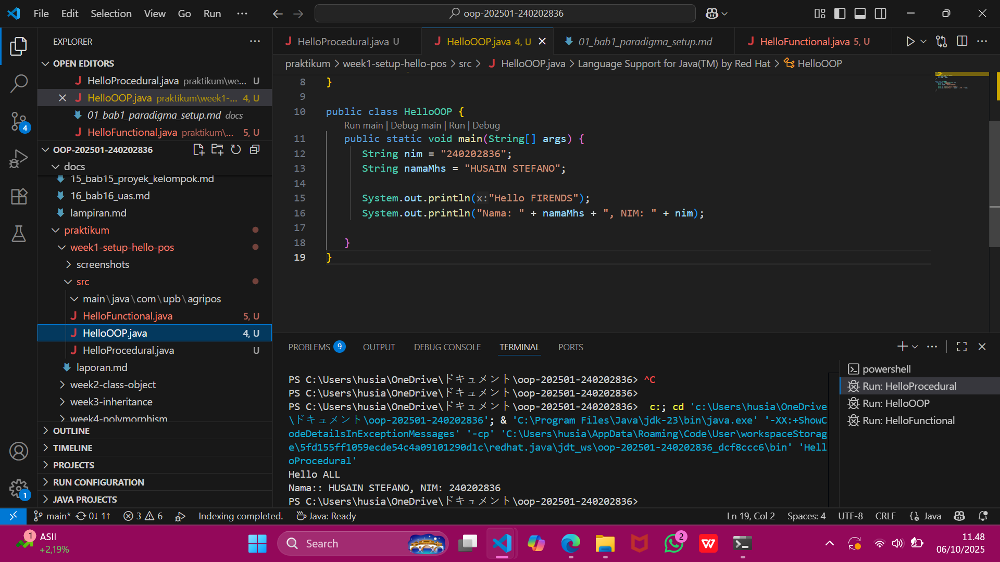
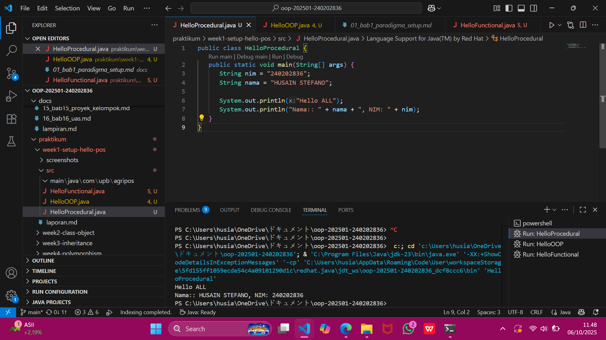

# Laporan Praktikum Minggu 1 (sesuaikan minggu ke berapa?)
Topik: ["tugas1 praktikum "]

## Identitas
- Nama  : [HUSAIN STEFANO]
- NIM   : [240202836]
- Kelas : [3IKRA]

---

## Tujuan
Mahasiswa memahami konsep dasar paradigma pemrograman yang meliputi prosedural, berorientasi objek (OOP), dan fungsional, serta mampu:
-Menjelaskan perbedaan dan karakteristik dari tiap paradigma.
-Membandingkan kelebihan dan kekurangan masing-masing pendekatan.
-Mengimplementasikan program sederhana “Hello World” dalam ketiga paradigma tersebut.

---

## Dasar Teori 
1. Paradigma Prosedural,Berfokus pada urutan langkah (instruksi) yang dieksekusi secara berurutan.  
2. Paradigma Berorientasi Objek (OOP),Berfokus pada objek yang memiliki atribut (state) dan perilaku (behavior).  
3. Paradigma Fungsional,Menghindari perubahan data dan menggunakan konsep immutability.
---

## Langkah Praktikum
1. Pastikan lingkungan pemrograman sudah siap (misalnya: VS Code, NetBeans, atau Online Compiler untuk Java/C).
2. Siapkan file untuk masing-masing paradigma:

hello_prosedural.c (untuk paradigma prosedural)

HelloOOP.java (untuk paradigma berorientasi objek)

HelloFunctional.java (untuk paradigma fungsional)  
3. Upload hasil program dan laporan ke GitHub sesuai instruksi dosen.

---

## Kode Program
### 1. Prosedural
```java
public class HelloProcedural {
   public static void main(String[] args) {
      String nim = "240202836";
      String nama = "HUSAIN STEFANO";

      System.out.println("Hello ALL");
      System.out.println("Nama:: " + nama + ", NIM: " + nim);
   }
}
```
### 2. OOP
```java

public class HelloOOP {
   public static void main(String[] args) {
      String nim = "240202836";
      String namaMhs = "HUSAIN STEFANO";
      
      System.out.println("Hello FIRENDS");
      System.out.println("Nama: " + namaMhs + ", NIM: " + nim);
      
   }
}
```
### 3. Functional
```java
public class HelloFunctional {
   public static void main(String[] args) {
      String nim = "240202836";
      String nama = "HUSAIN STEFANO";
      
      System.out.println("Hello KIDS");
      System.out.println("Nama: " + nama + ", NIM: " + nim);
   
   }
}
```
---

## Hasil Eksekusi
  
**HelloFunctional**  


---

**HelloOPP**  


---

**HelloProcedural**


---

## Analisis
(
- Paradigma prosedural cocok digunakan untuk program sederhana seperti perhitungan atau skrip kecil.  
- Paradigma OOP unggul dalam membangun aplikasi skala besar karena mendukung modularitas dan reuse code.  
- Paradigma fungsional cocok untuk pemrosesan data besar, AI/ML, atau sistem yang memerlukan stabilitas data tinggi.
Dengan memahami ketiganya, mahasiswa dapat memilih paradigma yang paling sesuai dengan kebutuhan proyek yang dikerjakan.  
)
---

## Kesimpulan
Dari praktikum ini, mahasiswa dapat memahami bahwa setiap paradigma pemrograman memiliki tujuan, kelebihan, dan keterbatasan masing-masing.

Paradigma Prosedural menekankan langkah-langkah instruksi.

Paradigma OOP menekankan interaksi antar objek.

Paradigma Fungsional menekankan fungsi murni dan transformasi data.

Pemahaman terhadap ketiga paradigma ini menjadi dasar penting untuk mengembangkan perangkat lunak yang efisien, terstruktur, dan mudah dikelola.

---

## Quiz
Jawaban Quiz – Pertemuan 1: Pengenalan Paradigma Pemrograman

1. Apakah OOP selalu lebih baik dari prosedural?
   Jawaban:Tidak selalu. OOP lebih baik untuk sistem besar yang memerlukan modularitas dan pemeliharaan jangka panjang, tetapi untuk program sederhana atau skrip kecil, paradigma prosedural lebih efisien dan mudah diterapkan.

2. Kapan functional programming lebih cocok digunakan dibanding OOP atau prosedural?
   Jawaban:** Paradigma fungsional lebih cocok digunakan ketika program membutuhkan *data processing* paralel, manipulasi data besar, atau menghindari efek samping dari perubahan variabel, seperti pada aplikasi *AI/ML* atau *stream processing*.

3. Bagaimana paradigma (prosedural, OOP, fungsional) memengaruhi maintainability dan scalability aplikasi?
   Jawaban:
   Prosedural:** Sulit dipelihara untuk proyek besar karena ketergantungan antar fungsi.
   OOP:** Lebih mudah dipelihara dan dikembangkan karena bersifat modular dan mendukung *reusability*.
   Fungsional:** Skalabilitas tinggi karena fungsi bersifat independen dan mendukung eksekusi paralel.

4. Mengapa OOP lebih cocok untuk mengembangkan aplikasi POS dibanding prosedural?
   Jawaban:** Karena sistem POS (Point of Sale) melibatkan banyak entitas seperti produk, pelanggan, dan transaksi, yang dapat dimodelkan sebagai *objek*. Dengan OOP, setiap objek memiliki atribut dan perilaku sendiri, membuat sistem lebih terstruktur dan mudah dikembangkan.

5. Bagaimana paradigma fungsional dapat membantu mengurangi kode berulang (boilerplate code)?
   Jawaban:** Dengan menggunakan fungsi murni, ekspresi lambda, dan konsep *higher-order function*, paradigma fungsional memungkinkan kode lebih ringkas dan reusable sehingga mengurangi penulisan kode yang sama berulang kali.


