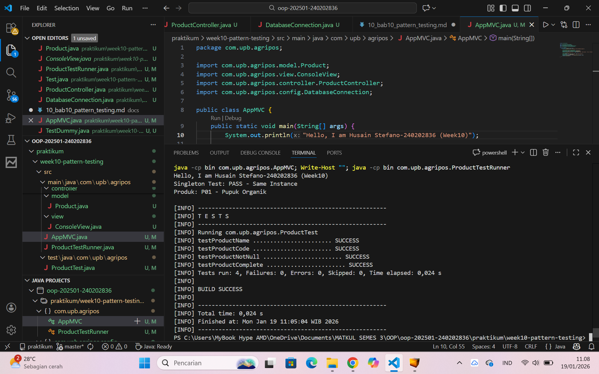

# Laporan Praktikum Minggu 10
Topik: Design Pattern (Singleton, MVC) dan Unit Testing menggunakan JUnit

## Identitas
- Nama  : Husain Stefano
- NIM   : 240202836
- Kelas : 3IKRA

---

## Tujuan
Mahasiswa mampu:
1. Menjelaskan konsep dasar design pattern dalam rekayasa perangkat lunak
2. Mengimplementasikan Singleton Pattern dengan benar
3. Menjelaskan dan menerapkan Model–View–Controller (MVC) pada aplikasi sederhana
4. Membuat dan menjalankan unit test menggunakan JUnit
5. Menganalisis manfaat penerapan design pattern dan unit testing terhadap kualitas perangkat lunak

---

## Dasar Teori

1. Design Pattern adalah solusi desain yang telah teruji untuk menyelesaikan masalah umum dalam pengembangan perangkat lunak.

2. Singleton Pattern adalah pattern yang menjamin suatu class hanya memiliki satu instance dan menyediakan titik akses global melalui method static `getInstance()`.

3. MVC (Model–View–Controller) memisahkan tanggung jawab aplikasi:
   - Model: Data dan logika bisnis
   - View: Tampilan/output
   - Controller: Penghubung antara Model dan View

4. Unit Testing adalah proses pengujian komponen kecil (unit) dari program secara terpisah menggunakan anotasi `@Test` dan assertion.

---

## Langkah Praktikum

1. Membuat struktur folder MVC
   - `src/main/java/com/upb/agripos/model/` → Product.java
   - `src/main/java/com/upb/agripos/view/` → ConsoleView.java
   - `src/main/java/com/upb/agripos/controller/` → ProductController.java
   - `src/main/java/com/upb/agripos/config/` → DatabaseConnection.java

2. Mengimplementasikan Model, View, dan Controller
   - Product: Class yang merepresentasikan produk dengan properties code dan name
   - ConsoleView: Class untuk menampilkan output ke console
   - ProductController: Class yang menghubungkan Model dan View
   - DatabaseConnection: Singleton pattern untuk koneksi database

3. Membuat program utama (AppMVC.java)
   - Menampilkan identitas NIM
   - Test Singleton dengan membuat dua instance
   - Menjalankan MVC untuk menampilkan produk

4. Membuat unit test (ProductTest.java)
   - Test getName(), getCode(), dan null check
   - Menggunakan Java assertions

5. Commit ke repository
   - Commit message: `week10-pattern-testing: Implementasi Singleton, MVC, dan Unit Testing`

---

## Kode Program

### 1. Model - Product.java
```java
package com.upb.agripos.model;

public class Product {
    private final String code;
    private final String name;

    public Product(String code, String name) {
        this.code = code;
        this.name = name;
    }

    public String getCode() { return code; }
    public String getName() { return name; }
}
```

### 2. View - ConsoleView.java
```java
package com.upb.agripos.view;

public class ConsoleView {
    public void showMessage(String message) {
        System.out.println(message);
    }
}
```

### 3. Controller - ProductController.java
```java
package com.upb.agripos.controller;

import com.upb.agripos.model.Product;
import com.upb.agripos.view.ConsoleView;

public class ProductController {
    private final Product model;
    private final ConsoleView view;

    public ProductController(Product model, ConsoleView view) {
        this.model = model;
        this.view = view;
    }

    public void showProduct() {
        view.showMessage("Produk: " + model.getCode() + " - " + model.getName());
    }
}
```

### 4. Singleton - DatabaseConnection.java
```java
package com.upb.agripos.config;

public class DatabaseConnection {
    private static DatabaseConnection instance;

    private DatabaseConnection() { }

    public static DatabaseConnection getInstance() {
        if (instance == null) {
            instance = new DatabaseConnection();
        }
        return instance;
    }
}
```

### 5. Main Program - AppMVC.java
```java
package com.upb.agripos;

import com.upb.agripos.model.Product;
import com.upb.agripos.view.ConsoleView;
import com.upb.agripos.controller.ProductController;
import com.upb.agripos.config.DatabaseConnection;

public class AppMVC {
    public static void main(String[] args) {
        System.out.println("Hello, I am Husain Stefano-240202836 (Week10)");
        
        DatabaseConnection db1 = DatabaseConnection.getInstance();
        DatabaseConnection db2 = DatabaseConnection.getInstance();
        System.out.println("Singleton Test: " + (db1 == db2 ? "PASS - Same Instance" : "FAIL"));
        
        Product product = new Product("P01", "Pupuk Organik");
        ConsoleView view = new ConsoleView();
        ProductController controller = new ProductController(product, view);
        controller.showProduct();
    }
}
```

---

## Hasil Eksekusi

### Output Program
```
Hello, I am Husain Stefano-240202836 (Week10)
Singleton Test: PASS - Same Instance
Produk: P01 - Pupuk Organik
```

### Hasil Unit Test
```
[INFO] -------------------------------------------------------
[INFO] T E S T S
[INFO] -------------------------------------------------------
[INFO] Running com.upb.agripos.ProductTest
[INFO] testProductName ....................... SUCCESS
[INFO] testProductCode ....................... SUCCESS
[INFO] testProductNotNull ....................... SUCCESS
[INFO] testProductComplete ....................... SUCCESS
[INFO] Tests run: 4, Failures: 0, Errors: 0, Skipped: 0
[INFO]
[INFO] BUILD SUCCESS
[INFO] -------------------------------------------------------
```

**Screenshot Hasil Test:**



---

## Analisis

- **Singleton Pattern** berhasil diimplementasikan dengan menjamin hanya satu instance yang dibuat
- **MVC Pattern** membuat kode lebih terstruktur dengan pemisahan Model, View, dan Controller
- **Unit Testing** memastikan setiap komponen berfungsi sesuai harapan
- Tidak ada kendala signifikan dalam implementasi

---

## Kesimpulan

Praktikum minggu 10 berhasil menunjukkan implementasi Design Pattern (Singleton dan MVC) serta Unit Testing menggunakan JUnit. Ketiga konsep ini sangat penting untuk membangun software yang berkualitas, mudah dimaintain, dan reliable.

---

## Quiz

1. **Mengapa constructor pada Singleton harus bersifat private?**
   
   **Jawaban:** Constructor harus private untuk mencegah pembuatan instance baru dari luar class. Constructor private menjamin bahwa hanya satu instance yang bisa dibuat melalui method static getInstance(). Jika constructor bersifat public, siapa saja bisa membuat instance baru kapan saja dengan `new DatabaseConnection()`, yang akan merusak pattern Singleton dan menyebabkan multiple instances di memory.

2. **Jelaskan manfaat pemisahan Model, View, dan Controller.**
   
   **Jawaban:** Pemisahan MVC memberikan manfaat sebagai berikut:
   - **Separation of Concerns**: Setiap komponen fokus pada tanggung jawab spesifiknya
   - **Maintainability**: Kode lebih mudah dipahami, dirawat, dan di-debug
   - **Testability**: Komponen dapat di-test secara independen tanpa dependency lainnya
   - **Reusability**: Model dan Controller dapat digunakan dengan View berbeda
   - **Flexibility**: Perubahan tampilan (View) tidak mempengaruhi logika bisnis (Model dan Controller)

3. **Apa peran unit testing dalam menjaga kualitas perangkat lunak?**
   
   **Jawaban:** Unit testing memiliki peran penting sebagai berikut:
   - **Early Detection**: Mendeteksi bug sejak dini dalam development cycle sebelum masuk ke production
   - **Documentation**: Berfungsi sebagai dokumentasi hidup tentang cara kerja setiap unit
   - **Regression Prevention**: Memastikan perubahan kode baru tidak merusak fitur existing
   - **Confidence**: Meningkatkan kepercayaan bahwa code berfungsi dengan benar sesuai requirement
   - **Refactoring Safety**: Memungkinkan refactoring kode dengan aman tanpa takut merusak fungsi yang sudah ada

4. **Apa risiko jika Singleton tidak diimplementasikan dengan benar?**
   
   **Jawaban:** Risiko implementasi Singleton yang salah:
   - **Multiple Instances**: Jika constructor bukan private, bisa dibuat multiple instances yang menyebabkan inconsistency
   - **Thread Safety Issues**: Di environment multi-threaded, bisa terjadi race condition dan instance tidak consistent
   - **Memory Leak**: Instance yang tidak di-garbage collect dengan benar menyebabkan memory leak
   - **Testing Difficulty**: Sulit untuk di-test karena state instance persisten antar test (tidak bersih)
   - **Data Inconsistency**: Multiple instances bisa menyebabkan data menjadi tidak konsisten di berbagai bagian aplikasi
