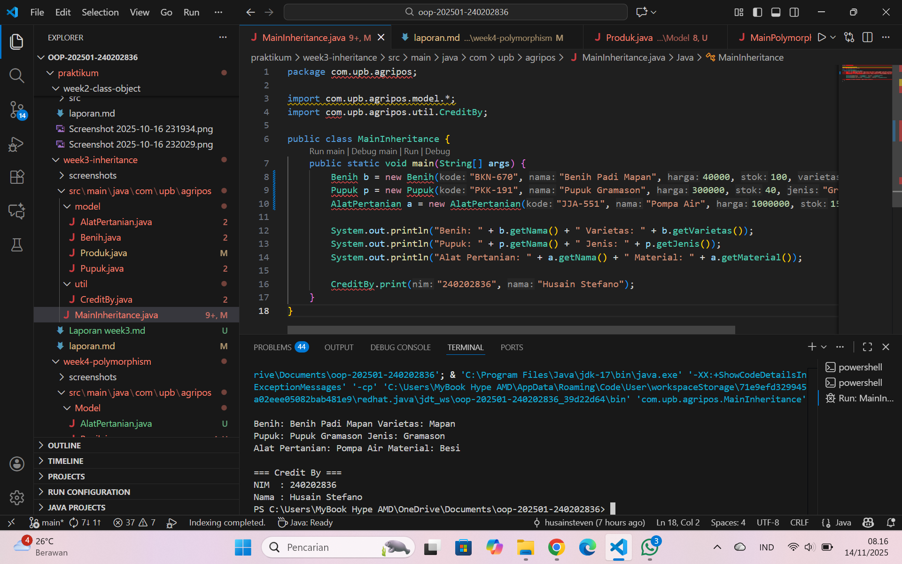

# Laporan Praktikum Minggu 3
Topik: Inheritance (Kategori Produk)

## Identitas
- Nama  : Husain Stefano
- NIM   : 240202836
- Kelas : 3IKRA

---

## Tujuan
- Mahasiswa mampu menjelaskan konsep inheritance (pewarisan class) dalam OOP.
- Mahasiswa mampu membuat superclass dan subclass untuk produk pertanian.
- Mahasiswa mampu mendemonstrasikan hierarki class melalui contoh kode.
- Mahasiswa mampu menggunakan super untuk memanggil konstruktor dan method parent class.
- Mahasiswa mampu membuat laporan praktikum yang menjelaskan perbedaan penggunaan inheritance dibanding class tunggal.


---

## Dasar Teori
Inheritance adalah mekanisme dalam OOP yang memungkinkan suatu class mewarisi atribut dan method dari class lain.

- Superclass: class induk yang mendefinisikan atribut umum.
- Subclass: class turunan yang mewarisi atribut/method superclass, dan dapat menambahkan atribut/method baru.
- Super digunakan untuk memanggil konstruktor atau method superclass.
Dalam konteks Agri-POS, kita dapat membuat class Produk sebagai superclass, kemudian Benih, Pupuk, dan AlatPertanian sebagai subclass. Hal ini membuat kode lebih reusable dan terstruktur.


---

## Langkah Praktikum
1. Membuat Superclass Produk
- Gunakan class Produk dari Bab 2 sebagai superclass.

2. Membuat Subclass
- Benih.java → atribut tambahan: varietas.
- Pupuk.java → atribut tambahan: jenis pupuk (Urea, NPK, dll).
- AlatPertanian.java → atribut tambahan: material (baja, kayu, plastik).

3. Membuat Main Class
- Instansiasi minimal satu objek dari tiap subclass.
- Tampilkan data produk dengan memanfaatkan inheritance.

4. Menambahkan CreditBy
- Panggil class CreditBy untuk menampilkan identitas mahasiswa.

5. Commit dan Push
- Commit dengan pesan: week3-inheritance.

---

## Kode Program
1. AlatPertanian.java

```java
package com.upb.agripos.model;

public class AlatPertanian extends Produk {
    private String material;

    public AlatPertanian(String kode, String nama, double harga, int stok, String material) {
        super(kode, nama, harga, stok);
        this.material = material;
    }

    public String getMaterial() { return material; }
    public void setMaterial(String material) { this.material = material; }
}
```

2. Benih.java

```java
package com.upb.agripos.model;

public class Benih extends Produk {
    private String varietas;

    public Benih(String kode, String nama, double harga, int stok, String varietas) {
        super(kode, nama, harga, stok);
        this.varietas = varietas;
    }

    public String getVarietas() { return varietas; }
    public void setVarietas(String varietas) { this.varietas = varietas; }
}
```

3. Produk.java

```java
package com.upb.agripos.model;

public class Produk {
    private String kode;
    private String nama;
    private double harga;
    private int stok;

    public Produk(String kode, String nama, double harga, int stok) {
        this.kode = kode;
        this.nama = nama;
        this.harga = harga;
        this.stok = stok;
    }

    public String getKode() { return kode; }
    public String getNama() { return nama; }
    public double getHarga() { return harga; }
    public int getStok() { return stok; }

    public void setKode(String kode) { this.kode = kode; }
    public void setNama(String nama) { this.nama = nama; }
    public void setHarga(double harga) { this.harga = harga; }
    public void setStok(int stok) { this.stok = stok; }

    public void tampilInfo() {
        System.out.println("Kode: " + kode);
        System.out.println("Nama: " + nama);
        System.out.println("Harga: Rp" + harga);
        System.out.println("Stok: " + stok);
    }

}
```

4. Pupuk.java
```java
package com.upb.agripos.model;

public class Pupuk extends Produk {
    private String jenis;

    public Pupuk(String kode, String nama, double harga, int stok, String jenis) {
        super(kode, nama, harga, stok);
        this.jenis = jenis;
    }

    public String getJenis() { return jenis; }
    public void setJenis(String jenis) { this.jenis = jenis; }
}

5. CreditBy.java

```java
package com.upb.agripos.util;

public class CreditBy {
    public static void print(String nim, String nama) {
        System.out.println("\n=== Credit By ===");
        System.out.println("NIM  : " + nim);
        System.out.println("Nama : " + nama);
    }
}

6. MainInheeritance.java

```java
package com.upb.agripos;

import com.upb.agripos.model.*;
import com.upb.agripos.util.CreditBy;

public class MainInheritance {
    public static void main(String[] args) {
        Benih b = new Benih("BKN-670", "Benih Padi Mapan", 40000, 100, "Mapan");
        Pupuk p = new Pupuk("PKK-191", "Pupuk Gramason", 300000, 40, "Gramason");
        AlatPertanian a = new AlatPertanian("JJA-551", "Pompa Air", 1000000, 15, "Besi");

        System.out.println("Benih: " + b.getNama() + " Varietas: " + b.getVarietas());
        System.out.println("Pupuk: " + p.getNama() + " Jenis: " + p.getJenis());
        System.out.println("Alat Pertanian: " + a.getNama() + " Material: " + a.getMaterial());

        CreditBy.print("240202836", "Husain Stefano");
    }
}
---

## Hasil Eksekusi



---

## Analisis
Program ini menunjukkan implementasi konsep inheritance (pewarisan) dalam Java. Class Produk berperan sebagai superclass yang menampung atribut dan method umum dari semua produk. Kemudian, class Benih, Pupuk, dan AlatPertanian menjadi subclass yang mewarisi atribut dan method dari Produk serta menambahkan atribut khusus masing-masing.

Saat objek subclass dibuat, constructor subclass akan memanggil constructor superclass menggunakan super(...).

Method tampilkanInfo() di subclass menggunakan overriding, yaitu memanggil super.tampilkanInfo() terlebih dahulu untuk menampilkan data umum, lalu menambahkan data khusus subclass.

Perbedaan dengan minggu sebelumnya: Pada minggu sebelumnya, setiap class berdiri sendiri tanpa pewarisan. Minggu ini program lebih terstruktur dan efisien karena menggunakan konsep inheritance, sehingga tidak perlu menulis ulang atribut dan method yang sama di setiap class.

Kendala: Awalnya terjadi error pada struktur package (package com.upb.agripos vs main.java.com.upb.agripos). Solusinya adalah memastikan struktur folder dan deklarasi package sesuai dengan letak file di dalam proyek Java.
---

## Kesimpulan
Dengan menggunakan inheritance, program menjadi lebih terorganisir, mudah dikembangkan, dan mengurangi duplikasi kode. Konsep ini memungkinkan reuse (penggunaan ulang) kode superclass di subclass dengan penambahan fitur yang lebih spesifik.

---

## Quiz

1. Apa keuntungan menggunakan inheritance dibanding membuat class terpisah tanpa hubungan?
Jawaban: Inheritance memberikan keuntungan karena kita dapat menyimpan atribut dan method yang bersifat umum di dalam satu superclass, sehingga tidak perlu menulis ulang kode yang sama di banyak class. Hal ini membuat struktur program menjadi lebih rapi, mudah dirawat, dan perubahan pada perilaku umum cukup dilakukan di superclass sehingga otomatis berlaku untuk semua subclass. Selain itu, inheritance juga memungkinkan penggunaan polymorphism sehingga subclass dapat menambahkan atau mengubah perilaku tanpa merusak struktur dasarnya.  

2. Bagaimana cara subclass memanggil konstruktor superclass?
Jawaban: Subclass dapat memanggil konstruktor superclass dengan menggunakan keyword super(), dan pemanggilan ini harus ditempatkan pada baris pertama di dalam konstruktor subclass. Jika konstruktor superclass memiliki parameter, maka parameter tersebut juga harus diberikan ketika memanggil super(). Dengan cara ini, nilai-nilai yang dibutuhkan superclass dapat terinisialisasi sebelum bagian khusus dari subclass dijalankan. 

3. Berikan contoh kasus di POS pertanian selain Benih, Pupuk, dan Alat Pertanian yang bisa dijadikan subclass.
Jawaban: Di dalam sistem POS pertanian, selain Benih, Pupuk, dan Alat Pertanian, masih banyak kategori lain yang dapat dijadikan subclass. Misalnya obat tanaman atau pestisida, pakan ternak, media tanam seperti tanah organik atau cocopeat, bibit tanaman hias, perlengkapan irigasi seperti selang dan sprinkler, hingga produk hasil panen seperti buah, sayuran, atau beras. Semuanya memiliki karakteristik dasar yang sama, seperti nama produk, harga, dan stok, sehingga cocok diturunkan dari superclass yang sama.
