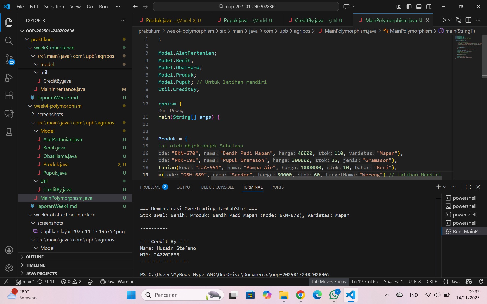

# Laporan Praktikum Minggu 4
Topik: Polymorphism (Info Produk)

## Identitas
- Nama  : Husain Stefano
- NIM   : 240202836
- Kelas : 3IKRA

---

## Tujuan
- Mahasiswa mampu menjelaskan konsep polymorphism dalam OOP.
- Mahasiswa mampu membedakan method overloading dan overriding.
- Mahasiswa mampu mengimplementasikan polymorphism (overriding, overloading, dynamic binding) dalam program.
- Mahasiswa mampu menganalisis contoh kasus polymorphism pada sistem nyata (Agri-POS).

---

## Dasar Teori
Polymorphism berarti “banyak bentuk” dan memungkinkan objek yang berbeda merespons panggilan method yang sama dengan cara yang berbeda.

- Overloading → mendefinisikan method dengan nama sama tetapi parameter berbeda.
- Overriding → subclass mengganti implementasi method dari superclass.
- Dynamic Binding → pemanggilan method ditentukan saat runtime, bukan compile time.

Dalam konteks Agri-POS, misalnya:
- Method getInfo() pada Produk dioverride oleh Benih, Pupuk, AlatPertanian untuk menampilkan detail spesifik.
- Method tambahStok() bisa dibuat overload dengan parameter berbeda (int, double).

---

## Langkah Praktikum

1. Overloading
Tambahkan method tambahStok(int jumlah) dan tambahStok(double jumlah) pada class Produk.
Overriding

Tambahkan method getInfo() pada superclass Produk.
Override method getInfo() pada subclass Benih, Pupuk, dan AlatPertanian.
Dynamic Binding

Buat array Produk[] daftarProduk yang berisi objek Benih, Pupuk, dan AlatPertanian.
Loop array tersebut dan panggil getInfo(). Perhatikan bagaimana Java memanggil method sesuai jenis objek aktual.
Main Class

Buat MainPolymorphism.java untuk mendemonstrasikan overloading, overriding, dan dynamic binding.
CreditBy

Tetap panggil CreditBy.print("<NIM>", "<Nama>").
Commit dan Push

Commit dengan pesan: week4-polymorphism.

---

## Kode Program
(Tuliskan kode utama yang dibuat, contoh:  

```java
// Contoh
Produk p1 = new Produk("BNH-001", "Benih Padi", 25000, 100);
System.out.println(p1.getNama());
```
)
---

## Hasil Eksekusi
  


---

## Analisis
- Cara Kerja Kode: Program utama (MainPolymorphism) menginisialisasi sebuah array Produk[] yang berisi empat objek subclass (Benih, Pupuk, AlatPertanian, ObatHama). Saat program melakukan iterasi pada array ini, variabel p memiliki tipe referensi Produk. Namun, ketika p.getInfo() dipanggil, Dynamic Binding terjadi: JVM memeriksa tipe objek aktual saat runtime dan memanggil method getInfo() yang telah di-override di subclass yang sesuai (misal, getInfo() milik Benih saat p menunjuk ke objek Benih).

- Demo Overloading: Program juga mendemonstrasikan Overloading dengan sukses. Pemanggilan produkTes.tambahStok(10) memanggil versi (int), dan produkTes.tambahStok(5.5) memanggil versi (double), yang terlihat jelas dari output cetak yang berbeda ((int) vs (dari double)).

- Perbedaan vs Minggu Sebelumnya: Minggu lalu (Inheritance) kita fokus pada mewarisi properti dan method. Minggu ini (Polymorphism), kita fokus pada mengubah perilaku method yang diwarisi tersebut (overriding) dan memperlakukan objek-objek berbeda seolah-olah mereka satu tipe yang sama (dynamic binding dalam array).

- Kendala: Tidak ada kendala signifikan. Kode berjalan sesuai ekspektasi. Implementasi Latihan Mandiri (ObatHama) juga berhasil diintegrasikan ke dalam array daftarProduk dan menampilkan output yang benar.

---

## Kesimpulan
Polymorphism memungkinkan kode yang lebih fleksibel dan mudah dipelihara. Kita dapat menulis kode generik (seperti loop for (Produk p : ...) ) yang dapat bekerja dengan berbagai objek subclass (Benih, Pupuk, dll) tanpa perlu mengetahui tipe spesifiknya.

---

## Quiz
1. Apa perbedaan overloading dan overriding?  
   Jawaban:Overloading adalah penggunaan beberapa method dengan nama yang sama dalam satu kelas, tetapi memiliki perbedaan pada jumlah atau tipe parameternya. Overloading diproses pada saat compile-time karena compiler menentukan metode mana yang digunakan berdasarkan parameter yang dikirim.
   Sementara itu, overriding adalah ketika subclass mendefinisikan ulang method yang sudah ada di superclass dengan nama dan parameter yang sama. Overriding diproses pada saat runtime, karena Java akan memilih method berdasarkan objek sebenarnya, bukan tipe referensinya.

2.  Bagaimana Java menentukan method mana yang dipanggil dalam dynamic binding?
    Jawaban:Dalam dynamic binding, Java menentukan method yang dijalankan berdasarkan tipe objek yang sebenarnya pada saat program berjalan. Meskipun referensi variabel menggunakan tipe superclass, Java tetap melihat objek nyata yang dihasilkan oleh new, kemudian memilih versi method yang sesuai dengan kelas objek tersebut. Dengan kata lain, pemanggilan method ditentukan saat runtime, bukan saat compile-time.

3. Berikan contoh kasus polymorphism dalam sistem POS selain produk pertanian. 
   Jawaban:Contoh yang mudah adalah pada sistem POS restoran. Misalnya ada kelas induk bernama MenuItem, kemudian subclass seperti Food, Drink, dan Dessert. Ketika sistem menghitung total belanja, semuanya dipanggil melalui referensi MenuItem, tetapi setiap objek akan menjalankan method calculatePrice() versi masing-masing. Makanan bisa punya pajak lebih besar, minuman mungkin punya biaya tambahan, sedangkan dessert bisa memiliki diskon khusus. Walaupun dipanggil melalui referensi yang sama, hasil perhitungan berbeda sesuai tipe objek yang sebenarnya. Itu adalah bentuk polymorphism dalam POS.
